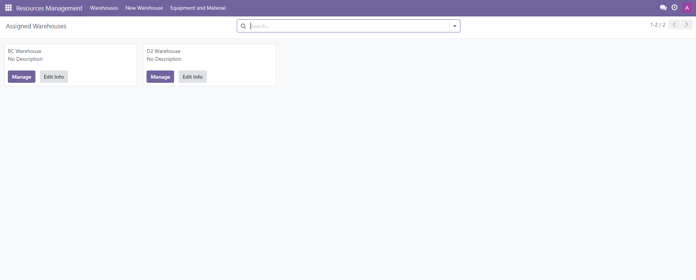
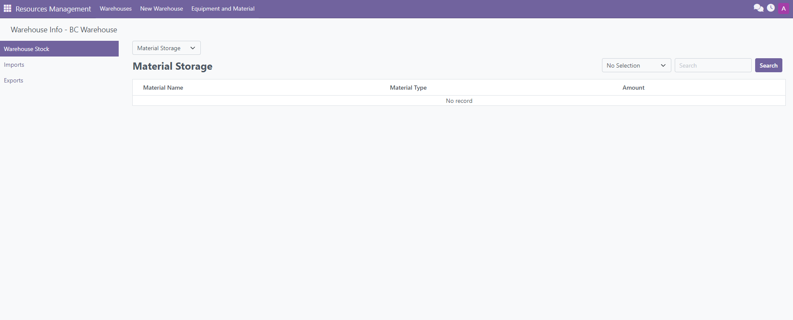

# cpm-odoo-proj
## Overview
An Odoo's construction projects managements module that manages multiple projects with features such as planning, managing work assignments, finance, risks and issues, documents and contracts, view and manage assigned works, work quality management, stocks, and more.

## Features
- Create and manage multiple construction projects.
- Create project workflows, tasks for each workflows, assign task members and contractors, attach documents.
- View and manage records of project's investments and expenses.
- View, manage and download versions of project's documents and contracts.
- View, manage and resolve project's risks and issues.
- View and manage assigned tasks.
- Manage, process and evaluate completed tasks.
- Manage project stakeholders such as investors, contractors, suppliers nad other contacts.
- Create and manage warehouses, view each assigned warehouse stocks, manage warehouse's imports and exports.

## Installation
### Installation Steps
- Clone or download the repository.
- Install Docker.
- Install Odoo and PostgreSQL images in Docker.
- Use Docker's terminal and run the Docker Compose file compose.yaml.
- On the web browser, connect to localhost:8069 to access the Odoo's web server.
- Create new database and login to the database.
- Go to the "App" section in the menu and search for the "Construction Project Management" module.
- Activate and assign the current user permission to create projects to start creating projects.

## Previews
##### Project Management Features
- [Workflow Management](#workflow-management)
- [Task Management](#task-management)
- [Document Management](#document-management)
- [Contract Management](#contract-management)
- [Finance Management](#finance-management)
- [Task Evaluation Management](#task-evaluation-management)

##### Assigned Work Management
- [Assigned Work Overview](#assigned-work-overview)
- [Assigned Task Details](#assigned-task-details)

##### Resources Management
- [Assigned Warehouses Menu](#assigned-warehouses-menu)
- [Warehouse Management](#warehouse-management)

### Project Management
##### Assigned Projects View

##### Project Overview

#### Workflow Management
##### Overview

##### Manage Workflow

##### Workflow Tasks

##### Workflow Schedule

#### Task Management
##### Assigned Staffs

##### Assigned Contractors

##### Attached Documents

##### Task Expenses

#### Document Management
##### Document Lists

##### Document Details

#### Contract Management
##### Contract Lists

##### Contract Details

#### Finance Management
##### Overview 

##### Budgets Tab

#### Task Evaluation Management
##### Active Tasks 

##### Pending Tasks 

##### Verified Tasks 

### Assigned Work Management
#### Assigned Work Overview 
##### Active Tasks

##### Completed Tasks

#### Assigned Task Details
##### Task Checklists

##### Document Attachments

##### Comments

##### Recent Notes

### Resources Management
#### Assigned Warehouses Menu

#### Warehouse Management
##### Warehouse Imports

##### Warehouse Exports

##### Warehouse Stocks
